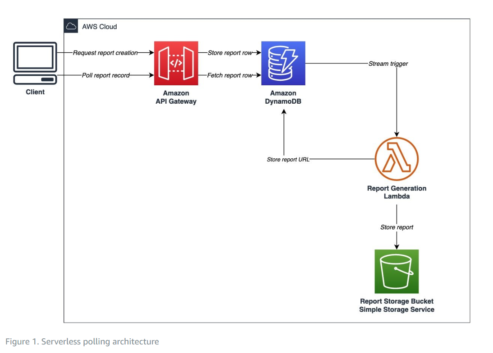

# CSVtoGoogleSlides

**This code takes a CSV file and a Google Slide Template, it then appends the data to the template in a meaningful way.**\
*Developed for Advertize.net for integration with AWS lambda.*\
*Contact: reynoldson2002@gmail.com*

index.html has example code to access the API from a web app (Cannot be run locally as AWS does not allow API calls from localhost).

## Accessing the Google Slides API
There is a dedicated Google Cloud Project for this application as we need to read and write to Google Slide files. Currently it is not published so your gmail account will need to be on the testing user's list to access. To add an account, email reynoldson2002@gmail.com and it will be added ASAP. On logging in to google through the app portal an access token will be created.

**Google Client ID:** '341236422016-lcv56vfvqpcsdoqq6ahjpa6ghrpn57rc.apps.googleusercontent.com'\
**Google App ID:** '341236422016'\
**Required Scopes:** 'https://www.googleapis.com/auth/drive.metadata.readonly https://www.googleapis.com/auth/presentations https://www.googleapis.com/auth/drive'

The **Google Picker API** is a great way to select slide files within a web app. It provides a window with the familiar Google Design and allows us to return the ID of the required template file. Documentation of this can be found here https://developers.google.com/drive/picker/guides/overview

## AWS REST API Endpoints

### Post Request
API Endpoint
~~~
https://pq2xyqsgla.execute-api.eu-north-1.amazonaws.com/testing
~~~
The passed data should be raw JSON containing 
1. Google Access Token
2. Template File ID
3. Output File Name
4. CSV Data
   
Example JSON Data
~~~
{
"accessToken":"ya29.a0AfB_byCpXNY9ZOryFUqdK_Ru3kVMNtyQFKK6djp5R1QbMqd0Qo8a5eN17D1K9NJajNZtj4_KoZX9pMT7Rs169",
"fileID":"1JTViOt75gUXKLHf-sOYe_CPsvThV7J0AaKjWa9LwlIw",
"outputName":"OUTPUT File",
"CSVdata":{"data":[["Slide Type","Table Type","Title","Table Name","Target Calls","Data","","","","","","","","","","","",""],
  ["Skip","","","Title Slide","","","","","","","","","","","","","",""],
  ["Single","Ripple","All Accounts","Combined","3528","10/08/2023","$214,463","98@$2,188","0.50","1,778@$121","$138,182","71@$1,946","0.57"],
  ["Single","Ripple","All Google","","","10/08/2023","$138,182","","71@$1,946","0.57","1,778@$78","(,25,46,)","$722,119","","480@$1,504","0.77"],                       ["Single","Ripple","Goog/Criminal","","","10/08/2023","$65,433","13@$5,033","17@$3,849","0.34","615@$106","(,13,4,)","$278,217"]
}
~~~
API Call Example
~~~
  fetch("https://pq2xyqsgla.execute-api.eu-north-1.amazonaws.com/testing/", {
      method: "POST",
      body: JSON.stringify({
          accessToken,
          fileID,
          outputName,
          CSVdata
  }),
      headers: {
          "Content-type": "application/json",
          "Accept":"*/*"
  }
  })
~~~

### Getting a Response from AWS
Sometimes the API will take several minutes to process and get data from Google. Therefore this POST request is asynchronous and no response is given.

